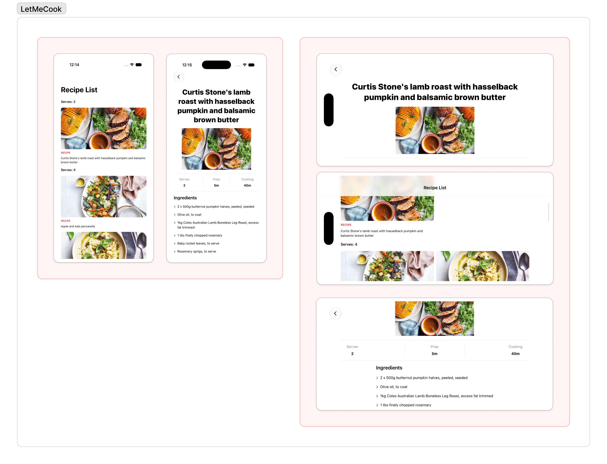
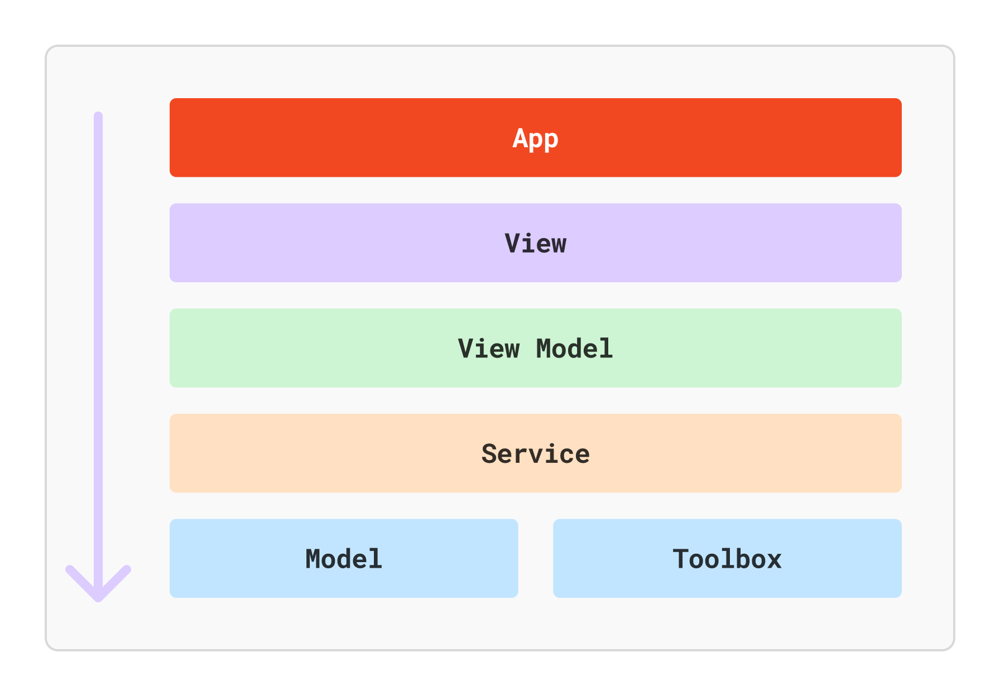

# Coles Mobile App Engineering Coding Excercise

|Item|Description|
| --- | --- |
|iOS App | Swift, SwiftUI   |
|Unit Tests | Swift Tests |
|UI Test | XCTest |
|IDE | Xcode 27 - beta, macOS Golden Gate 27.0||
|AI Tools | Claude Code - [ App, Xcode ]|  |

---

## Media:



<details>
<summary>Feature Walkthrough</summary>

| All Features | Orientation Change |
|-----|-----|
| <video src="./Resources/lmc-walkthrough-01.MP4" /> | <video src="./Resources/lmc-walkthrough-02.MP4" /> |

</details>

---

## Decision Records:

| Record | Decision | Why | Revisit |
|:-----|:-----|:-----|:-----|
| Architecture | MVVM | Given the use case plus testability | When scales |
| Folder | (L -> R): Models & definitions, Services, View Model, View | No SPM, simple plain folders | When scales move to SPM |
| Navigation | Simple Navigation Stack | For 2 screens, No NavStack path or coordinator pattern |  NavStack preferred path when scales |
| Image Caching | AsyncImage with URLCache | Given the data sets | Custom ImageLoader, or others |
| Pagination | None | Given the data sets | Revisit for larger sets - simple or cursor based |

### Folder Structure:



```bash
.
├── Model
│   ├── App
│   ├── Data
│   ├── Domain
│   └── Features
├── Presentation
│   ├── View
│   └── View Model
├── Service
│   └── FileRecipeService
└── Toolbox
```

---

##  Requirements:

<details>
<summary>Functional Requirements</summary>

### Functional
1. Consume the json from the given file. See [recipesSample.json](Resources/recipesSample.json).
2. Follow Design Guidelines for the app layout. See [design-ref](Resources/design-ref.png).
3. Handle error where appropriate
4. Orientation - Portrait / Landscape
5. Unit Test: At-least one of the below alogrithm: [See Algorithm](#algorithm)
  * Starting with `Group recipes by serving size`
6. Accessibility - Picking `Text Size` & `Voice Over` first.

#### Nice to Haves:
1. UI-Test
2. Accessibility - All | Text, Voice Over, Contrast

#### Algorithm:

Implement one of the following, with accompanying unit tests:
1.	Sort recipes by total time (prep + cooking)
2.	Group recipes by serving size
3.	Filter recipes by a maximum cooking time
4.	Parse and normalise time strings (e.g. "2h 20m" → minutes)

</details>

### Non Functional Requirements:

<details>
<summary>Non-Functional Requirements</summary>

Derived from assumptions or best practices:
1. Cold start `< 1 s` | Simple at first, revist for LIVE APIs
2. Device Types - iOS (assumed) | Clarify - iPad, Mac App ?
3. Min Target OS - `iOS 17 & above` | Matching the curent Coles app min version
4. Layout - Should be strict 2 column ? 
  1. Assumption: Match the best responsive layout (inferred), could be more than 2 based on the size
5. Caching strategies - May be simpler at first with in-memory or URL caching for media & data  | Consistency - Eventual or strong? May be eventual

#### Revisit for scale:
1. Scroll for large sets of data
2. Network layer

</details>

---

## Observations:

### Json contains invalid characters
- fail gracefully, as the data quality is mostly good.

### TODO

- [x] Implement Lossy Field [ref: Swift by Sundell](https://www.swiftbysundell.com/articles/ignoring-invalid-json-elements-codable/)
- [ ] Fix Voice Over in Details 
- [ ] Runtime: Symbolic break point on `unsafeForcedSync`
  ```log
  Potential Structural Swift Concurrency Issue: unsafeForcedSync called from Swift Concurrent context.
  ```
- [ ] Convert service into actor
- [ ] Check for task cancellation
- [ ] Add a UI Test